# CPU core: fetch, execute, memory, and retirement

**Source:** [`rv32i_core.v`](../../rtl/cpu/rv32i_core.v). The production instance sets `RESET_PC=0` and `DIAGNOSTIC_MODE=0`. Tests can select a different reset PC and diagnostic stop behavior.

## State sequence

```mermaid
stateDiagram-v2
  [*] --> FETCH_REQ
  FETCH_REQ --> FETCH_RESP: instruction accepted
  FETCH_RESP --> READ_RS2: word returned; capture rs1
  READ_RS2 --> EXEC: capture rs2
  EXEC --> FETCH_REQ: simple instruction/trap
  EXEC --> DATA_REQ: load/store/LR/SC/AMO
  EXEC --> MDU_WAIT: multiply/divide
  DATA_REQ --> DATA_RESP: data request accepted
  DATA_RESP --> FETCH_REQ: ordinary memory complete
  DATA_RESP --> AMO_WRITE_REQ: AMO read complete
  AMO_WRITE_REQ --> AMO_WRITE_RESP: write accepted
  AMO_WRITE_RESP --> FETCH_REQ: write complete
  MDU_WAIT --> FETCH_REQ: result ready
```

The CPU holds `pc` and `instr` while a request is outstanding. `FETCH_REQ` waits for instruction acceptance; `FETCH_RESP` waits for its result. On a successful fetch the core latches source 1 from the register file, reads source 2 in `READ_RS2`, and decodes in `EXEC`. A simple instruction retires by pulsing `retire_valid` and recording `retire_pc`. Memory and MDU instructions retire after their response. There is no pipeline overlap, branch prediction, speculative execution, or data cache. Interrupts are sampled before a new fetch in production mode. All paths ultimately return to `FETCH_REQ`; diagnostic mode can enter `STOP`.

## Register file and shared logic

The architectural register file has x0 fixed to zero and 31 mutable 32-bit words. RTL storage is four banks of eight words. Selection of one banked asynchronous read path is multiplexed by `reg_read_index`: during `FETCH_RESP` it uses the fetched instruction's rs1 field, otherwise rs2. `operand_a` and `operand_b` hold the values for `EXEC`. A single write port distributes write enable by index high bits; writes to x0 are suppressed. The testbench-visible `regs[0:31]` wires alias the banks; they are not a second storage array. General registers are intentionally not reset, as the ISA does not specify their reset contents. Current standalone mapping still attributes 1,024 storage flip-flops to the four declared banks, including the x0 bank word; the read bypass makes x0 architecturally zero. See the [generated area breakdown](../rtl-block-diagrams/README.md).

The adder `shared_add` handles ADD/ADDI, SUB (invert B plus carry), load/store effective addresses, and JALR. PC-relative increments and branch/jump target calculations have their own expressions and may map to other hardware. A single right-shift datapath performs SRL/SRA and, by reversing bits before and after, SLL. Sharing reduces mapped gates but makes muxing part of the path. The iterative MDU is separate. See [MDU](mdu-and-privilege.md).

## Decode and instruction effects

The core constructs I/S/B/U/J immediates from `instr` with sign extension. It handles LUI, AUIPC, JAL, JALR, six branch comparisons, integer register/immediate ALU operations, load and store sizes, M extension operations, A extension word operations, FENCE, FENCE.I, CSRs, ECALL, EBREAK, MRET, SRET, SFENCE.VMA, and WFI. Unsupported encodings trap as illegal. The design does not decode compressed or floating point instructions. `FENCE`/`FENCE.I` have no cache-flush hardware because there is no cache; the serialized memory path already orders issued operations. WFI is accepted as an instruction, but should not be read as a complete low-power sleep implementation.

| Instruction class | Implemented path |
|---|---|
| Branch/JAL/JALR | Compute `next_pc`; misaligned target traps; JALR clears bit 0 |
| LB/LBU/LH/LHU/LW | Aligned 32-bit bus read; select byte/halfword by saved low address bits, then sign/zero extend |
| SB/SH/SW | Shift source word into addressed byte lanes and assert byte strobes; misaligned half/word traps |
| MUL*, DIV*, REM* | Assert MDU start and wait; result writes destination after `done` |
| LR.W | Read word, then record address reservation |
| SC.W | Return 1 immediately if reservation misses; otherwise issue store and return 0 on success |
| AMO*.W | Read old word, calculate new value from retained `operand_b`, write word, return old value |
| CSR | Privilege unit checks address/permission and performs write/set/clear at commit |

An AMO is a read followed by a write using this single-hart, single-request path. `operand_b` remains unchanged across the memory response, so the atomic rewrite avoids a dedicated 32-bit atomic operand hold register. The reservation is an address plus valid bit; a store clears it. This is sufficient for the modeled single-hart bus but should be rechecked if DMA, multiple masters, or externally coherent devices are introduced. The `aq` and `rl` bits do not add a separate memory-ordering structure to the already serialized path.

## Faults and traps

Fetch access errors become instruction access or page faults depending on the adapter's page-fault flag. A decoded illegal instruction, misaligned target/access, EBREAK, or ECALL creates the relevant synchronous cause. Data response errors are classified as load/store access or page faults. The core sends cause, faulting `pc`, and `tval` to the privilege unit, then uses its trap vector. The privilege unit owns delegation and trap CSRs. A trap does not retire the faulting instruction. In diagnostic mode, selected faults and EBREAK instead set `fault`, `fault_pc`, and halt, useful for small tests but unlike production Linux behavior.

## Performance interpretation

The sequential source reads add a state to every normally fetched instruction. On a TLB miss, page-table reads and possible A/D writeback add serial memory transactions. Linux boot therefore takes billions of simulated cycles even though the clock period is 50 ns in the intended hardware configuration. In RTL simulation, the simulator advances logical cycles as quickly as the host can execute them; wall time per cycle is not tied to 50 ns. Performance analysis should use the acceptance log's retirement, RAM request, flash request, and UART markers rather than only elapsed host time.
