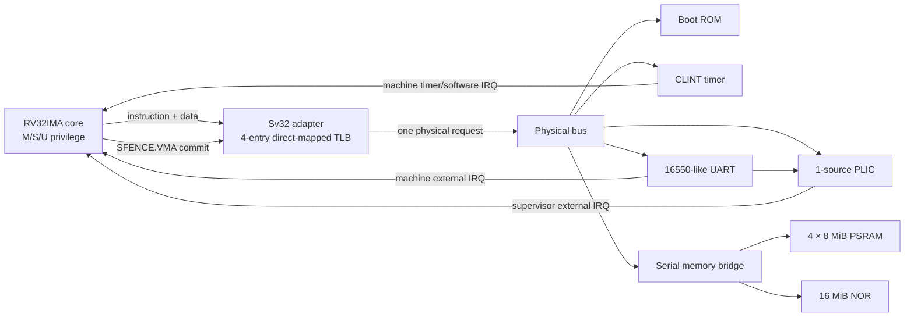

# System architecture

**Source:** [`soc_top.v`](../../rtl/soc/soc_top.v), [`tt_um_rv32_linux_soc.v`](../../rtl/soc/tt_um_rv32_linux_soc.v). **Scope:** current integrated RTL.

The core is sequential and in-order. It sends one instruction or data request through the Sv32 adapter; the adapter either bypasses translation or walks page tables through the same physical bus. The physical bus holds the selected target until that target responds. There is no cache, burst transfer, DMA engine, on-chip SRAM large enough for Linux, or speculative memory system. This is why every fetched instruction and external-memory data access can become an SPI transaction.

The core implements the integer machine used by the image: RV32I, multiply/divide, atomics, CSR and instruction-fence operations, and machine/supervisor/user privilege. Compressed and floating-point instructions are absent. The CPU register file is standard-cell storage organized as four eight-word banks. A single multiplexed read path reads the two source operands in different states. The MDU takes repeated cycles; it is not a combinational multiplier or divider. [CPU detail](../rtl/cpu-core.md).

The 32 MiB RAM is four separate 8 MiB PSRAM dies. The upper two bits of the 25-bit RAM window offset select a die. All memory chips share the low two data lanes; PSRAM and NOR have distinct upper data lanes and independent chip-select pins. The serial bridge time-multiplexes all five chips. A NOR control register block permits programming/erasing, but the boot path only needs NOR reads. [Serial details](../rtl/serial-memory.md).

## Clock, reset, and external boundary

All state in the integrated RTL uses `clk` and active-low `rst_n`. `soc_top` resets the CPU, adapter, bus, and peripherals together; the serial bridge waits `POWERUP_CYCLES=3000` clocks before resetting the four PSRAMs with `66h`/`99h`. At 20 MHz this initial counter lasts 150 µs, excluding command overhead. The bridge produces SCK from its state machine at roughly one cycle per two SoC clocks during a transfer. The UART synchronizes its incoming RX signal before sampling frames. The clock source, reset circuit, power sequencing, pad drive, and memory wiring are platform responsibilities, discussed in [power and IO](../physical/power-clock-and-io.md).

`soc_top` selects `RESET_PC=0x0000_0000` so the CPU starts in ROM. The production top sets `DIAGNOSTIC_MODE=0`, which routes exceptions to the privilege unit. Directed tests can enable diagnostic mode to halt on faults or EBREAK and expose `fault_pc`. The Tiny Tapeout wrapper exports logical pins, not explicit supply or analog pad devices. The FPGA wrapper instantiates the same `soc_top` and routes its own UART pins to the board bridge. See [integration](../rtl/integration-and-pins.md).

## What a typical Linux memory access does

1. The core raises an instruction or data request and waits for `ready`.
2. The Sv32 adapter checks the effective privilege and `satp`. It either bypasses translation, finds a matching TLB entry, or reads level-1/level-0 PTEs on the physical bus.
3. On a leaf with missing A or D bits, it writes the PTE back before issuing the original access.
4. The physical bus selects exactly one region. A PSRAM request enters the serial bridge; a 32-bit read emits command, address, turnaround, and data phases on SCK/DQ.
5. The response returns through bus and adapter to the core. A fault is classified into a page or access exception, then the privilege unit records trap CSRs and redirects `pc`.

The design favors small area over throughput. Its physical viability, boot-cycle count, and timing are measured separately rather than assumed from this diagram.
