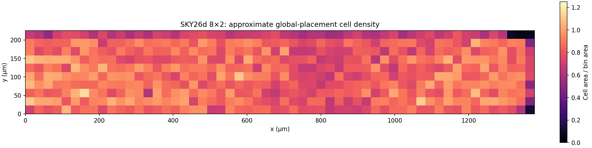

# First SKY26d physical baseline (historical 8×2 attempt)

This is a measurement of the existing RTL, not a tapeout fit claim. No ISA, memory topology, or other product behavior changed.
Later 5×4 routed results and their physical checks are in the
[experiment results](../experiments/RESULTS.md). The
[next-session plan](../experiments/NEXT-SESSION.md) defines the new full-GDS
qualification gate.

## Reproduce the first measurements

```sh
make synth-sky130
make stage-sky26d
```

On this macOS host, the [Tiny Tapeout local hardening workflow](https://tinytapeout.com/guides/local-hardening/) was run with an active Podman machine:

```sh
uv venv --python 3.11 build/sky130/venv
uv pip install --python build/sky130/venv/bin/python \
  -r build/tt-support-tools/requirements.txt 'librelane==3.0.14'
cd build/sky130/ttsky26d-stage
export PATH="$PWD/../venv/bin:$PATH"
export PDK_ROOT="$HOME/.volare"
export DYLD_FALLBACK_LIBRARY_PATH=/opt/homebrew/lib
python tt/tt_tool.py --create-user-config
python tt/tt_tool.py --harden
```

Run this in a fresh staged workspace to reproduce the first attempt; `stage-sky26d` protects an existing physical run from being erased. The `ttsky26d` [GDS action](https://github.com/TinyTapeout/tt-gds-action/tree/ttsky26d) currently pins LibreLane 3.0.14.

`synth-sky130` uses the locally enabled SKY130A `sky130_fd_sc_hd` typical 25 °C, 1.80 V Liberty file. It records the RTL commit, Yosys version, PDK source commit and Liberty SHA-256 in `build/sky130/tt_025C_1v80/versions.txt`. The complete synthesis script, mapped netlist and Yosys log are retained beside it. This host has Yosys 0.63 and open_pdks `0fe599b2afb6708d281543108caf8310912f54af`.

`stage-sky26d` creates an ignored workspace at `build/sky130/ttsky26d-stage` from Tiny Tapeout's [SKY130 Verilog template](https://github.com/TinyTapeout/ttsky-verilog-template) commit `83d305501d505b157cd6e9ba87bc8ffd949526fd` and [support tools](https://github.com/TinyTapeout/tt-support-tools) commit `01d5d2814fa9dd61e9d211e0b235a4a592a9316a`. It copies the current RTL and ROM hex, selects an **8×2** tile shape, sets a **50 ns (20 MHz)** clock period, and generates a provisional pin description. The generated `baseline.json` records the exact source revisions. No staged source is submitted or pushed by these commands. The stage script refuses to overwrite a workspace containing physical results.

For the initial 2026-09-24 run at RTL commit `120d965`, the mapped standard-cell area is **224,972 µm²**, of which **114,540 µm²** (50.9%) is sequential cells. This is an area-only Yosys mapping with no clock, IO or wire timing constraints. The official support tools specify a 1,378.16 × 225.76 µm (311,133 µm²) outer die rectangle for 8×2. Mapped cells occupy 72.3% of that entire rectangle. The template's nominal placement density target is 60%, and the placeable region is smaller than the die rectangle; placement, buffers, CTS and routing therefore present a serious fit risk. A LibreLane floorplan/placement result is required to quantify it.

| Module | Mapped cell area (µm²) |
|---|---:|
| RV32 core logic, excluding MDU and privilege submodules | 82,852 |
| Sv32 adapter and TLB | 63,361 |
| Iterative MDU | 22,180 |
| Privilege unit | 18,355 |
| Serial memory bridge | 17,651 |
| Timer | 9,224 |
| UART | 6,898 |
| ROM, bus and PLIC | 4,452 |

The module areas sum to the mapped total, subject to rounding. They are a starting point for review, not measured savings from a design change.

## First Tiny Tapeout/LibreLane attempt

The staged project passed Tiny Tapeout's source and pin configuration check, then ran LibreLane **3.0.14** through the `ttsky26d` action-compatible flow on Podman. LibreLane downloaded SKY130A PDK revision `8afc8346a57fe1ab7934ba5a6056ea8b43078e71`. This is a different PDK revision and mapping flow from the standalone Yosys estimate above. The full compressed run log, stage metrics and exact source revisions are retained in [`reports/sky26d-120d965`](reports/sky26d-120d965/).

| Flow point | Measured result |
|---|---:|
| TT 8×2 die outline | 311,133 µm² |
| Placeable core | 302,420 µm² |
| After TT/LibreLane mapping and floorplanning | 252,455 µm² cells; 83.5% core utilization |
| After global placement | 257,959 µm² instances; 85.3% core utilization |
| Post-placement electrical repair | 3,578 buffers inserted on 703 nets; reported area growth about 13% |
| Detailed placement during that repair | **Failed**: 367 instances could not be legalized (`DPL-0036`) |

Global placement warned that the 60% density target was below available free area and that local uniform density exceeded 97%. At the nominal 60% of the measured core, the area budget is 181,452 µm², already 76,507 µm² below the global-placement instance area **before** the additional repair buffers. Merely raising the density target cannot resolve the observed legalization failure or prove routability. No CTS, detailed route, extracted timing, GDS, DRC or LVS result exists from this attempt.



The heatmap bins placed-cell LEF areas by location before electrical repair. It is a visual guide to local crowding, not a legal-placement or routing metric. Recreate it with `tt/plot_global_placement.py` and the retained global-placement DEF plus the pinned PDK LEF.

The pre-CTS, pre-route timing snapshot at the nominal PDK corner reported setup WNS −18.55 ns, dominated by `rst_n` to `uio_oe` paths under LibreLane's **generic fallback SDC**; register-to-register worst setup slack was +16.58 ns. This is not a 20 MHz signoff result. Dedicated reset, asynchronous UART RX, SPI and external IO constraints are still required, followed by CTS and routed timing. The same snapshot reported thousands of hold violations before CTS; these are not final hold results.

**Decision point for the owner:** the current RTL does not legalize in 8×2 under the first shuttle-compatible flow. Review the pin plan, hierarchy areas and failed placement before selecting one reversible area experiment. Candidate investigations are TLB capacity, register-file implementation, MDU sharing and serial-controller state/registers; each needs an area delta and the same Linux shell/digit workload. Preserve the four-PSRAM/NOR topology, required RV32IMA/Sv32 behavior and the owner's dot4 implementation boundary. An area-only estimate or a denser floorplan is not a replacement for a routed pass.
